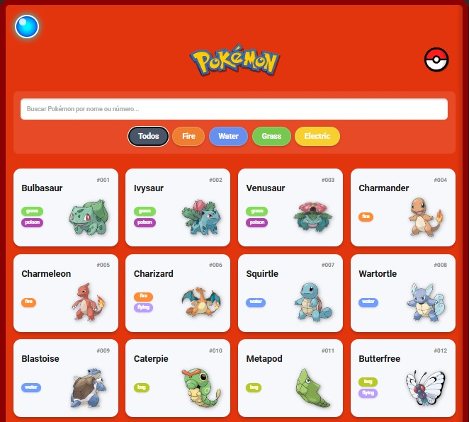
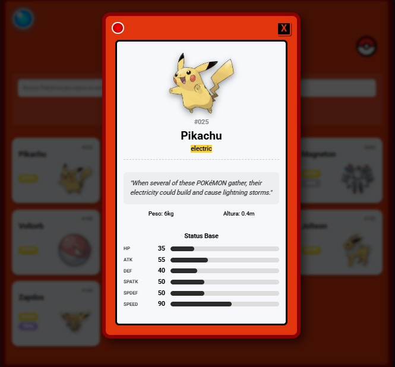

# # 🔴 Pokédex - Formação JavaScript Developer (DIO)

  
  

## 📝 Sobre o Projeto

Este projeto é uma Pokédex interativa desenvolvida como parte do Desafio de Projeto da **Formação JavaScript Developer** da [DIO (Digital Innovation One)](https://www.dio.me/). 

O objetivo inicial do desafio era consumir a PokéAPI e listar os Pokémons usando JavaScript puro (Vanilla). No entanto, este projeto foi expandido muito além do escopo original, ganhando um design inspirado na Pokédex clássica do anime, lógicas de filtragem locais e consumo de múltiplas APIs simultaneamente.

> 🔗 **Acesse o projeto online:** [Clique aqui para testar a Pokédex](https://dgsilvino.github.io/pokedex-js-developer/)

## ✨ Funcionalidades Adicionadas (Além do Desafio Original)

- **Design Aprimorado:** Interface customizada com tema da Pokédex clássica, incluindo logos, barra de rolagem e paleta de cores baseada nos tipos dos Pokémons.
- **Busca Dinâmica:** Barra de pesquisa em tempo real que filtra os Pokémons pelo nome ou pelo número da Pokédex.
- **Filtro por Tipos:** Botões interativos que categorizam a lista exibida com base no tipo do Pokémon (Fire, Water, Grass, etc).
- **Modal de Detalhes:** Ao clicar em um card, um modal interativo é aberto exibindo informações avançadas:
  - Sprite em alta resolução (Official Artwork).
  - Status Base com barras de progresso visuais.
  - Peso e Altura.
- **Tradução Simultânea (Integração com 2 APIs):** O sistema busca o *flavor text* (curiosidade) do Pokémon em inglês na PokéAPI e envia para a API externa **MyMemory** para traduzir para o Português em tempo real antes de exibir na tela. (Possui sistema de *fallback* para inglês caso ocorra limitação de requisições).

## 🚀 Tecnologias Utilizadas

- **HTML5:** Estruturação semântica.
- **CSS3:** Estilização, CSS Grid, Flexbox, animações e responsividade.
- **JavaScript (ES6+):** Lógica de programação, manipulação do DOM e requisições assíncronas.
- **[PokéAPI](https://pokeapi.co/):** Fornecimento de todos os dados e imagens dos Pokémons.
- **[MyMemory Translation API](https://mymemory.translated.net/):** Tradução dos textos de descrição de volta para português.

## ⚙️ Como executar o projeto

Como este é um projeto focado em Front-end (Vanilla), a execução é super simples e não exige a instalação de pacotes complexos (Node, NPM, etc).

1. Faça o clone deste repositório na sua máquina:
   git clone [dgsilvino/pokedex-js-developer · GitHub](https://github.com/dgsilvino/pokedex-js-developer.git)

2. Entre na pasta do projeto:
      cd nome-do-repositorio

3. Abra o projeto no seu editor de código favorito (recomendamos o **VS Code**).

4. Para visualizar, basta abrir o arquivo `index.html` no seu navegador.
   
   * **Dica:** Se estiver usando o VS Code, instale a extensão **Live Server** e clique com o botão direito no `index.html` > _Open with Live Server_ para ter uma experiência de desenvolvimento melhor.

👨‍💻 Autor
-----------

Criado por **Diego Gimenez Silvino**

* LinkedIn: https://www.linkedin.com/in/dg-silvino/

* GitHub: [dgsilvino (Diego Silvino) · GitHub](https://github.com/dgsilvino)

🤝 Projeto desenvolvido para consolidação de conhecimentos práticos!
